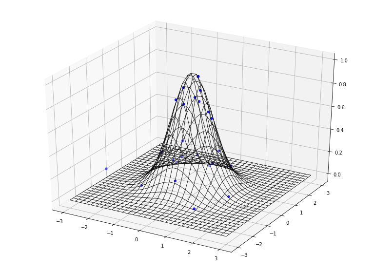
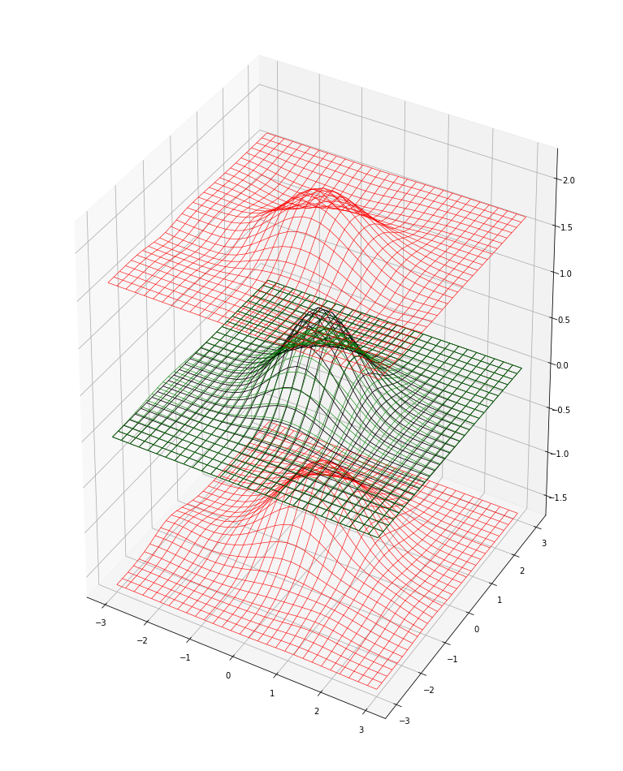
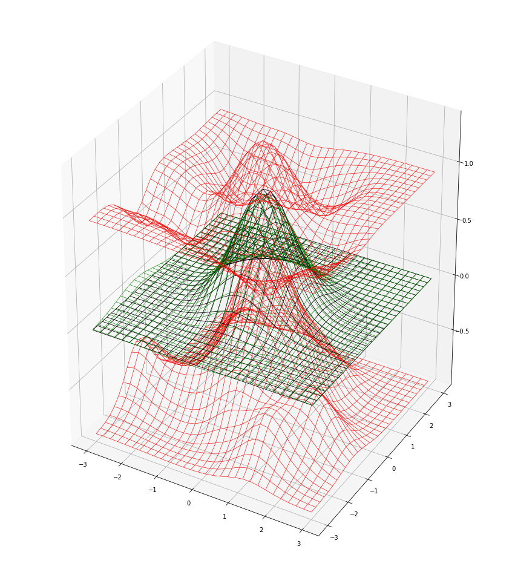
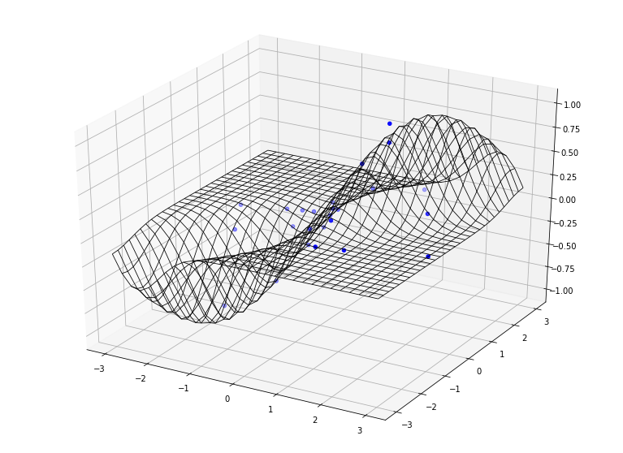
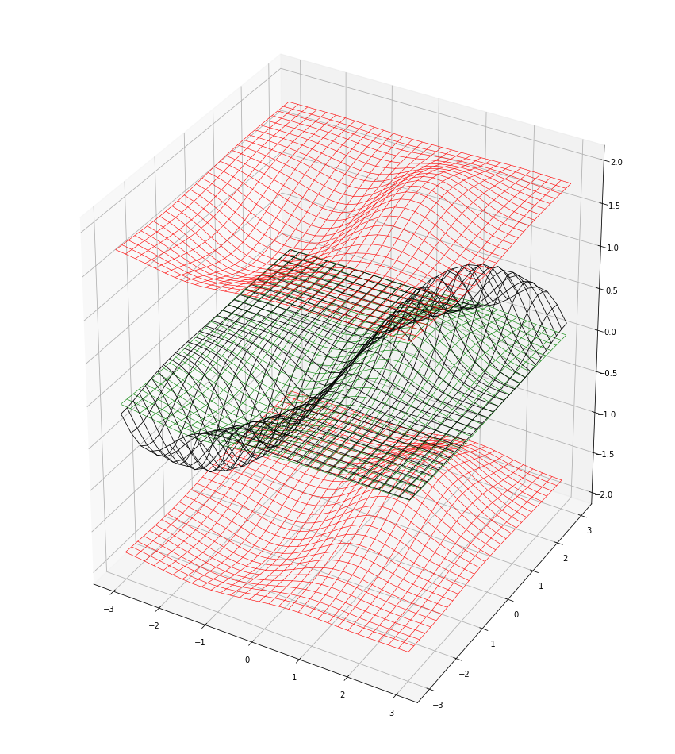
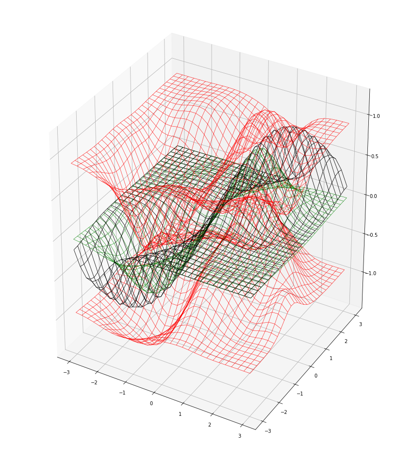

<h1>Gaussian Process</h1>
Python 3.7.2<br>
Pytorch 1.0.1<br>
matplotlib 3.0.2<br>
jupyter 1.0.0<br>
jupyter lab 0.35.3<br></h4>


```python
"Jupyter Lab Extension"
%load_ext autoreload
%autoreload 2
#%matplotlib ipympl

"패키지 불러오기"
import matplotlib.pyplot as plt
from mpl_toolkits.mplot3d import Axes3D
from mpl_toolkits.mplot3d import axes3d
import numpy as np
import torch
import torch.nn as nn
import torch.optim as optim
import torch.nn.init as init
import torch.nn.functional as F

print("CUDA Available :")
print(torch.cuda.is_available())
```

    CUDA Available :
    True


```python
"데이터 생성"
n = 25
train_x1 = torch.randn((n, 1))
train_x2 = torch.randn((n, 1))
train_x = torch.cat((train_x1, train_x2), 1)

# True function
train_y = torch.exp(- (train_x1**2 + train_x2**2)) + torch.randn((n, 1)) * 0.05
```


```python
"생성된 데이터 시각화"
def f(x, y):
    return np.exp( - (x**2  + y**2))

x = np.linspace(-3, 3, 30)
y = np.linspace(-3, 3, 30)
X, Y = np.meshgrid(x,y)
Z = f(X,Y)

fig = plt.figure(figsize=(13.5,10))
ax = fig.add_subplot(111, projection='3d')
ax.scatter(train_x1.tolist(), train_x2.tolist(), train_y.tolist(), color='blue')
ax.plot_wireframe(X, Y, Z, color='black', linewidth = 0.8)
plt.show()
```





```python
class GP(nn.Module):
    def __init__(self, ndim_x, ndim_y):
        super(GP, self).__init__()
        "입력변수 및 목표변수 차원 지정"
        self.ndim_x = ndim_x
        self.ndim_y = ndim_y
        
        "GP 모델에 적합시킬 데이터 저장"
        self.data_x = torch.zeros(0, self.ndim_x)
        self.data_y = torch.zeros(0, self.ndim_y)
        
        "저장한 데이터에서 설명변수들을 가지고 L2 pairwise distance(Euclidean distance)를 구할 것"
        self.dist = torch.zeros((self.ndim_x, 0, 0))
        
        "Kernel Hyperparameter"
        self.KHP = nn.Conv2d(in_channels = self.ndim_x,
                             out_channels = self.ndim_y,
                             kernel_size = (1,1),
                             bias = False)
        
        "Noise Parameter"
        self.beta = nn.Linear(in_features = 1,
                              out_features = 1,
                              bias = False)
        

        "Parameter Initialization"
        for m in self.modules():
            if isinstance(m, nn.Conv2d):
                init.normal_(m.weight, mean=1, std=0.5)
            if isinstance(m, nn.Linear):
                init.normal_(m.weight, mean=1, std=0.5)
         
    
    "Distance Matrix 계산 함수"
    def distance(self, data_x):
        N = data_x.shape[0]
        D = data_x.shape[1]
        dist = torch.zeros(D, N, N)
        for dim in range(D):
            term1 = (data_x[:, dim] ** 2).expand((N,N))
            term2 = data_x[:, dim].unsqueeze(0).transpose(0, 1) * data_x[:, dim].unsqueeze(0)
            dist[dim] = (term1 + term1.transpose(0,1) - 2 * term2).unsqueeze(0)
        return dist

    
    "Noise 행렬 계산 함수"
    "Softplus activation function으로 정규분포 분산을 모수화(범위를 양수로 제한, 학습 안정화)"    
    def noise(self, dim):
        return F.softplus(self.beta(torch.ones(1))) * torch.eye(dim)

    
    "새로운 데이터의 X값들 추가"
    def fit_x(self, x_new):
        self.data_x = torch.cat((self.data_x, x_new), 0)
        self.dist = self.distance(self.data_x)
        
    "새로운 데이터의 Y값들 추가" 
    def fit_y(self, y_new):
        self.data_y = torch.cat((self.data_y, y_new), 0)
        
    
    "Pytorch에서 학습을 시키기 위해 꼭 필요한 forward Method"
    "적절한 Kernel 계산을 위해 maximum cliping"
    def forward(self):
        term1 = torch.clamp(-0.5 * self.KHP(self.dist.unsqueeze(0)).squeeze(0).squeeze(0), max = 0)
        term2 = self.noise(self.data_x.shape[0])
        cov_fitted = torch.exp(term1) + term2
        return cov_fitted
    
    
    "예측값(Mean vector, Autocovariance Matrix) 계산 함수"
    def predict(self, x_new, y_new):
        num_fitted = self.data_x.shape[0]
        dist = self.distance(torch.cat((self.data_x, x_new), 0))
        
        cov_fitted = torch.exp(
            -0.5 * self.KHP(dist[:, :num_fitted, :num_fitted].unsqueeze(0)).squeeze(0).squeeze(0)) +
            self.noise(num_fitted)
        cov_wing = torch.exp(
            -0.5 * self.KHP(dist[:, :num_fitted, num_fitted:].unsqueeze(0)).squeeze(0).squeeze(0))
        cov_new = torch.exp(
            -0.5 * self.KHP(dist[:, num_fitted:, num_fitted:].unsqueeze(0)).squeeze(0).squeeze(0)) +
            self.noise(x_new.shape[0])
        
        pred_mu = torch.matmul(torch.matmul(cov_wing.transpose(0,1), cov_fitted.inverse()), self.data_y)
        pred_cov = cov_new -
            torch.matmul(torch.matmul(cov_wing.transpose(0, 1), cov_fitted.inverse()), cov_wing) +
            self.noise(x_new.shape[0]) 
        
        return pred_mu, pred_cov

    
    
"사용자 정의 손실함수(Negative Log Likelihood)"
"Determinant 계산의 수치적 안정성을 위해 minimum cliping"
def NLL(y, cov_fitted):
    return torch.log(torch.clamp(torch.det(cov_fitted.squeeze(0).squeeze(0)), min = 1e-8)) +
    torch.matmul(torch.matmul(y.transpose(0,1), cov_fitted.inverse()), y)   
```


```python
"모델 선언"
model = GP(2, 1)
model.fit_x(train_x)
model.fit_y(train_y)

"파라미터 출력"
for params in model.parameters():
    print(params)
```

    Parameter containing:
    tensor([[[[1.4411]],
    
             [[1.8402]]]], requires_grad=True)
    Parameter containing:
    tensor([[1.1362]], requires_grad=True)


```python
"예측값 시각화"
x1, x2 = torch.meshgrid([torch.linspace(-3, 3, 30), torch.linspace(-3, 3, 30)])
z = model.predict(torch.cat((x1.contiguous().view(-1, 1), x2.contiguous().view(-1, 1)), 1),
    torch.zeros((30 * 30,1)))

"""
두개의 붉은 표면 사이가 약 80%의 신뢰구간
검정색 곡면이 true function
초록색 곡면이 predicted mean
"""
fig = plt.figure(figsize=(13.5,10))
fig.subplots_adjust(bottom=-0.2, top=1.1)
ax = fig.add_subplot(111, projection='3d')
ax.plot_wireframe(X, Y, Z, color='black',  linewidth= 0.8)
ax.plot_wireframe(x1.detach().numpy(), x2.detach().numpy(), z[0].view(30,30).detach().numpy(),
    color='green', linewidth= 0.6)
ax.plot_wireframe(x1.detach().numpy(), x2.detach().numpy(), z[0].view(30,30).detach().numpy() +
    0.84 * torch.sqrt(z[1].diag()).view(30, 30).detach().numpy(), color='red', linewidth= 0.6)
ax.plot_wireframe(x1.detach().numpy(), x2.detach().numpy(), z[0].view(30,30).detach().numpy() -
    0.84 * torch.sqrt(z[1].diag()).view(30, 30).detach().numpy(), color='red', linewidth= 0.6)
plt.show()
```





```python
epoch = 1000

lr = 1e-2
optimizer = torch.optim.SGD(model.parameters(), lr = lr)

for iteration in range(epoch):
    optimizer.zero_grad()
    cov = model.forward()
    loss = NLL(model.data_y, cov)
    loss.backward()
    optimizer.step()
    #for param_group in optimizer.param_groups:
        #param_group['lr'] = lr * ((epoch - iteration)/epoch)

for params in model.parameters():
    print(params)
```

    Parameter containing:
    tensor([[[[1.5611]],
    
             [[1.4661]]]], requires_grad=True)
    Parameter containing:
    tensor([[-1.9813]], requires_grad=True)


```python
"예측값 시각화"
x1, x2 = torch.meshgrid([torch.linspace(-3, 3, 30), torch.linspace(-3, 3, 30)])
z = model.predict(torch.cat((x1.contiguous().view(-1, 1), x2.contiguous().view(-1, 1)), 1),
    torch.zeros((30 * 30,1)))

"""
두개의 붉은 표면 사이가 약 80%의 신뢰구간
검정색 곡면이 true function
초록색 곡면이 predicted mean
"""
fig = plt.figure(figsize=(15,10))
fig.subplots_adjust(bottom=-0.2, top=1.1)
ax = fig.add_subplot(111, projection='3d')
ax.plot_wireframe(X, Y, Z, color='black', linewidth= 0.8)
ax.plot_wireframe(x1.detach().numpy(), x2.detach().numpy(), z[0].view(30,30).detach().numpy(),
    color='green', linewidth= 0.6)
ax.plot_wireframe(x1.detach().numpy(), x2.detach().numpy(), z[0].view(30,30).detach().numpy() +
    0.84 * torch.sqrt(z[1].diag()).view(30, 30).detach().numpy(), color='red', linewidth= 0.6)
ax.plot_wireframe(x1.detach().numpy(), x2.detach().numpy(), z[0].view(30,30).detach().numpy() -
    0.84 * torch.sqrt(z[1].diag()).view(30, 30).detach().numpy(), color='red', linewidth= 0.6)
plt.show()
```





```python
"데이터 생성"
n = 25
train_x1 = torch.randn((n, 1))
train_x2 = torch.randn((n, 1))
# True function is sin(2*pi*x) with Gaussian noise
train_x = torch.cat((train_x1, train_x2), 1)
train_y = torch.exp( - (train_x1 - train_x2)**2) * torch.sin(train_x1) + torch.randn((n, 1)) * 0.05
```


```python
"생성된 데이터 시각화"
fig = plt.figure(figsize=(13.5,10))
ax = fig.add_subplot(111, projection='3d')

def f(x, y):
    return np.exp(-(x - y)**2) * np.sin(x)
x = np.linspace(-3, 3, 30)
y = np.linspace(-3, 3, 30)
X, Y = np.meshgrid(x,y)
Z = f(X,Y)
ax.scatter(train_x1.tolist(), train_x2.tolist(), train_y.tolist(), color='blue')
ax.plot_wireframe(X, Y, Z, color='black', linewidth= 0.8)
plt.show()
```





```python
model = GP(2, 1)
model.fit_x(train_x)
model.fit_y(train_y)
for params in model.parameters():
    print(params)
```

    Parameter containing:
    tensor([[[[1.2951]],
    
             [[0.5915]]]], requires_grad=True)
    Parameter containing:
    tensor([[1.5686]], requires_grad=True)


```python
"예측값 시각화"
x1, x2 = torch.meshgrid([torch.linspace(-3, 3, 30), torch.linspace(-3, 3, 30)])
z = model.predict(torch.cat((x1.contiguous().view(-1, 1), x2.contiguous().view(-1, 1)), 1),
    torch.zeros((30 * 30,1)))

"""
두개의 붉은 표면 사이가 약 80%의 신뢰구간
검정색 곡면이 true function
초록색 곡면이 predicted mean
"""
fig = plt.figure(figsize=(15,10))
fig.subplots_adjust(bottom=-0.2, top=1.1)
ax = fig.add_subplot(111, projection='3d')
ax.plot_wireframe(X, Y, Z, color='black', linewidth= 0.8)
ax.plot_wireframe(x1.detach().numpy(), x2.detach().numpy(), z[0].view(30,30).detach().numpy(),
    color='green', linewidth= 0.6)
ax.plot_wireframe(x1.detach().numpy(), x2.detach().numpy(), z[0].view(30,30).detach().numpy() +
    0.84 * torch.sqrt(z[1].diag()).view(30, 30).detach().numpy(), color='red', linewidth= 0.6)
ax.plot_wireframe(x1.detach().numpy(), x2.detach().numpy(), z[0].view(30,30).detach().numpy() -
    0.84 * torch.sqrt(z[1].diag()).view(30, 30).detach().numpy(), color='red', linewidth= 0.6)
plt.show()
```





```python
epoch = 1000

lr = 1e-2
optimizer = torch.optim.SGD(model.parameters(), lr = lr)

for iteration in range(epoch):
    optimizer.zero_grad()
    cov = model.forward()
    loss = NLL(model.data_y, cov)
    loss.backward()
    optimizer.step()
    #for param_group in optimizer.param_groups:
        #param_group['lr'] = lr * ((epoch - iteration)/epoch)

for params in model.parameters():
    print(params)
```

    Parameter containing:
    tensor([[[[2.3207]],
    
             [[1.2282]]]], requires_grad=True)
    Parameter containing:
    tensor([[-2.1341]], requires_grad=True)


```python
"예측값 시각화"
x1, x2 = torch.meshgrid([torch.linspace(-3, 3, 30), torch.linspace(-3, 3, 30)])
z = model.predict(torch.cat((x1.contiguous().view(-1, 1), x2.contiguous().view(-1, 1)), 1),
    torch.zeros((30 * 30,1)))

"""
두개의 붉은 표면 사이가 약 80%의 신뢰구간
검정색 곡면이 true function
초록색 곡면이 predicted mean
"""
fig = plt.figure(figsize=(15,10))
fig.subplots_adjust(bottom=-0.2, top=1.1)
ax = fig.add_subplot(111, projection='3d')
ax.plot_wireframe(X, Y, Z, color='black', linewidth= 0.8)
ax.plot_wireframe(x1.detach().numpy(), x2.detach().numpy(), z[0].view(30,30).detach().numpy(),
    color='green', linewidth= 0.6)
ax.plot_wireframe(x1.detach().numpy(), x2.detach().numpy(), z[0].view(30,30).detach().numpy() +
    0.84 * torch.sqrt(z[1].diag()).view(30, 30).detach().numpy(), color='red', linewidth= 0.6)
ax.plot_wireframe(x1.detach().numpy(), x2.detach().numpy(), z[0].view(30,30).detach().numpy() -
    0.84 * torch.sqrt(z[1].diag()).view(30, 30).detach().numpy(), color='red', linewidth= 0.6)
plt.show()
```



